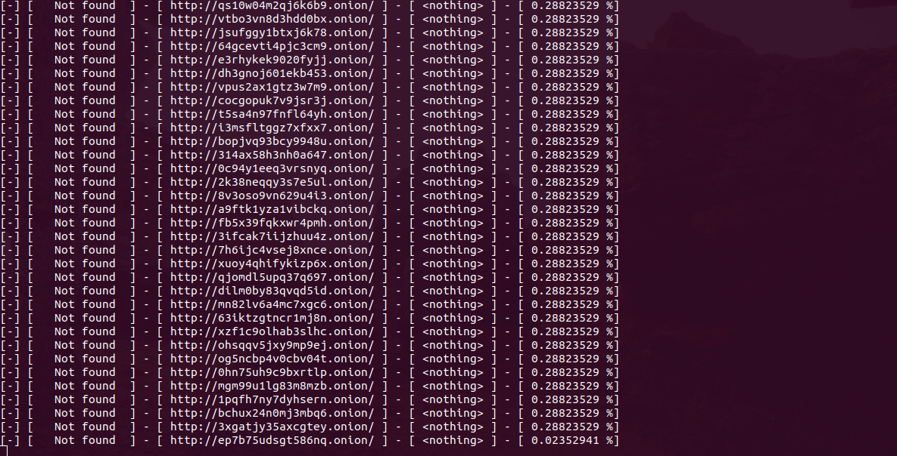

# DeepWeb Scapper

  

An simple script to scrappe deepweb to find pages. Will return if any of those exists and will save on a file. You should specify the name of the file to save.
If you wish to estimate the amount of requests, just multiply the number of the threads with the depth number.

Example:
* threads = 300
* depth = 350

Total requests: 105000

If you have an good internet connection, you can set from 1000 to 10000 for depth, and if you have an good CPU, set from 1000 to 5000 threads.
You should sit and wait from 2h to 8h to find something (with big numbers). If you have an low-end computer, it's more convenient to wait hours or days to find anything working. Be persistent. TOR links are pretty messy to scapre :) .

Screenshot with 30 million requests:

  

## Todo

* Search for links using dicionaries (for DarkWeb)
* More improves

## Requeriments

* Linux (any distro)
* TOR
* Python3 (requests, threading ,json, termcolor, string, bs4, socks, socket, random)
